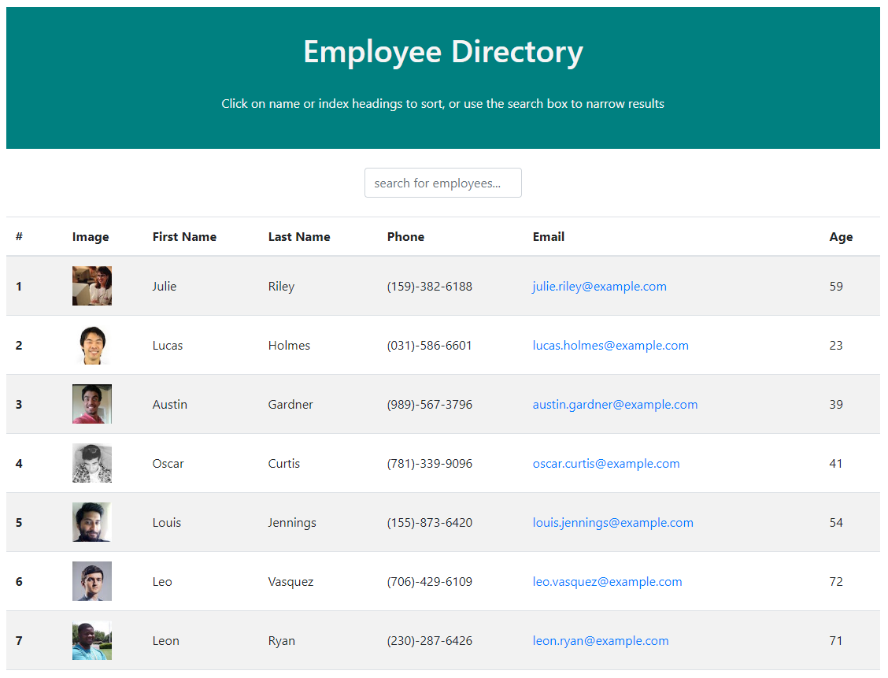

# Homework Week 19 - Employee Directory

This employee directory front-end application is created with React. The application's UI is broken up into components. The component state is set and managed in order to faciliate responses to user events (filtering or sorting user data).

## User Story

```
As a user, I want to be able to view my entire employee directory so that I have quick access to their information.

```

## Business Context

An employee or manager would benefit greatly from being able to view non-sensitive data about other employees. It would be particularly helpful to be able to filter employees by name.


## Composition of Application 

When the application first loads, the page displays the default list of employee data in a table (via API call). 

A user is then able to:

  * Search the directory via text search box to display matching results of first or last name.
  * Sort the table by first name, last name, or by the default index display. Carets appear upon hover on the       headings that are sortable. 

## Process

The dummy/seeded employee data is taken from the https://randomuser.me/ API. 

The different components created for the UI consist of a container to wrap the page, as well as a header, a search box, a table header, and a table body component.

In the Page.js component -

The componentDidMount function displays the default data from the API call (seeded 100 users in JSON format). The handleInputChange function uses the filter javascript method to update the results on the page to those matching (any part of) the first or last name that is typed in the search box. The sort functions use the sort javascript method (controlled by onClick of the header text) to arrange and display the employee data alphanumerically. 

Since this is a front end only application, it is deployed to Heroku without a database.

## Deployment

The completed application is available for download on Github: 
https://github.com/jenjch/userdirectory

Image of the application:



The deployed application is hosted on Heroku:
https://user-directory-031420.herokuapp.com/ 

## Acceptance Criteria

All requirements are met for application deployment. Feedback on improvements is appreciated.

## License

MIT license Copyright (c) 2020 Jenny Chen 
https://choosealicense.com/licenses/mit/ 